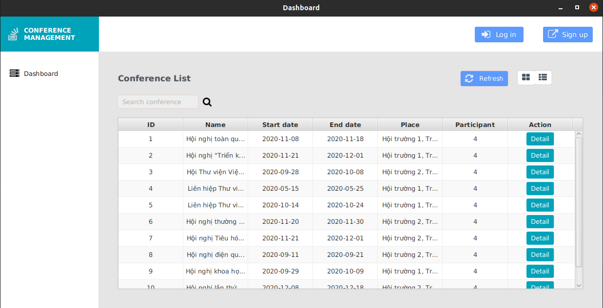
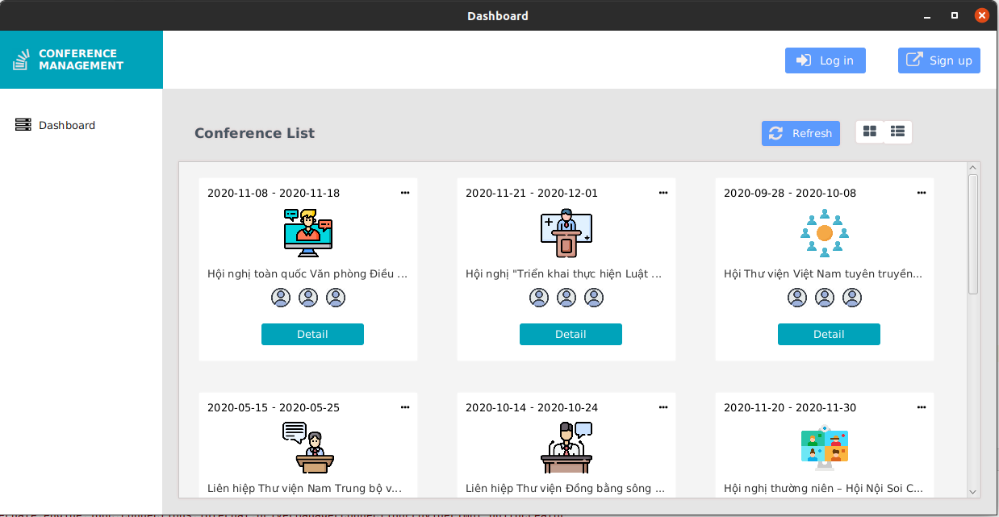
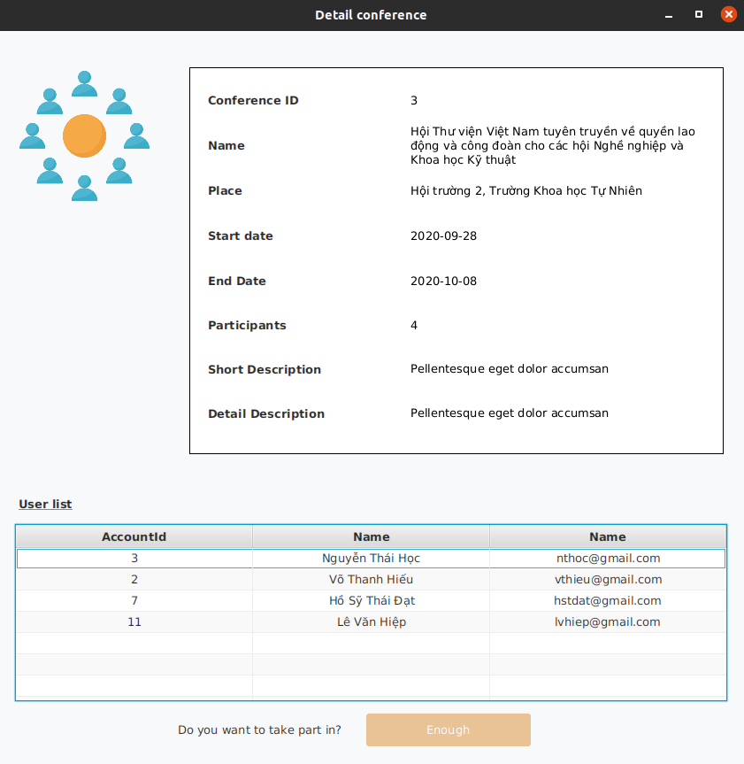
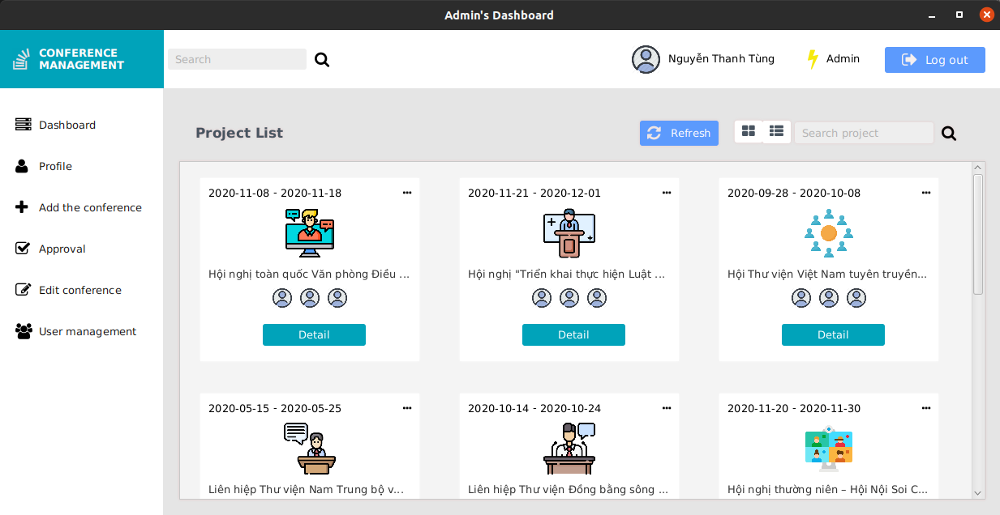
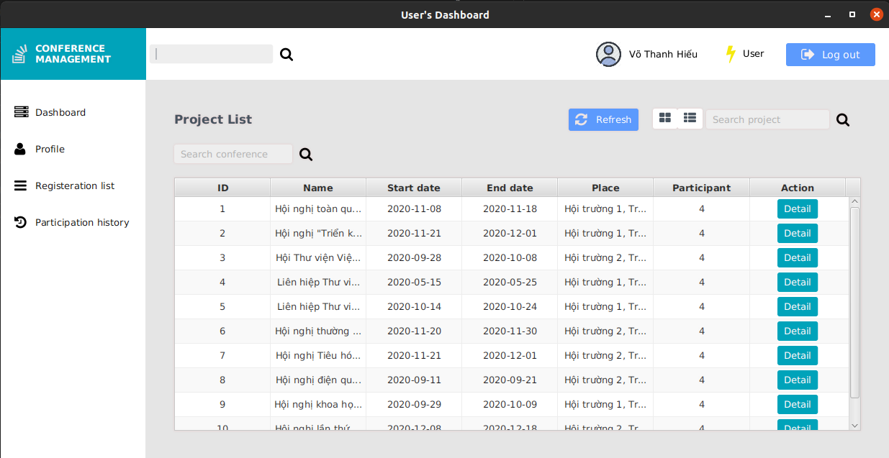

<!-- @format -->

# Quản lý hội nghị

## Tổng quan

- Đây là bài tập về **quản lý hội nghị** - sử dụng như một ứng dụng desktop thao tác với CSDL với ngôn ngữ Java 😃
- Có 2 phân hệ :
  - User : quản lý thông tin cá nhân và quản lý việc đăng ký
  - Admin : quản lý hôi nghi, tài khoản user và việc đăng ký hội nghi

## Các công nghệ sử dụng nè 🛸

- Hibernate
- MySQL
- JavaFX

## Tool và thư viện
- [Scene Builder](https://gluonhq.com/products/scene-builder/) (cái này dễ sử dụng lắm kéo thả vô là được, ngon lắm nên xài thử nè để làm giao diện JavaFX 🤩)
- Font Awesome 8.1 (cái này để thêm bên ngoài nha icon cho đẹp nè 😙)

## Cài đặt và cấu hình

- Java jdk 1.8
- Mình quản lý bằng Maven nên thêm dependency trong file POM.xml nha
- Các bạn tìm kiếm dependency tại [Maven respository](https://mvnrepository.com/)

## Môt số màn hình

|    |
| :----------------------------: |
| _1. Danh sách hội nghị dạng list_ |

|    |
| :----------------------------: |
| _2. Danh sách hội nghị dạng cardview_ |

|    |
| :----------------------------: |
| _3. Chi tiết hội nghị_ |

|    |
| :----------------------------: |
| _4. Màn hình trang chủ admin_ |

|    |
| :----------------------------: |
| _5. Màn hình trang chủ admin_ |

